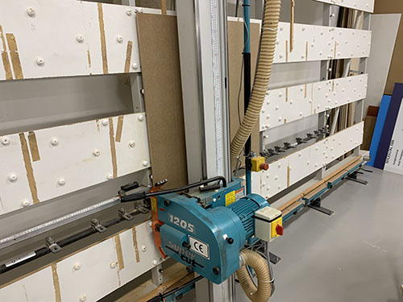
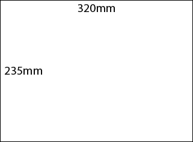
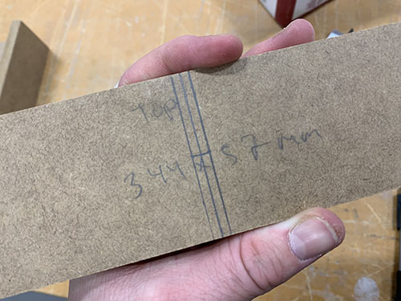
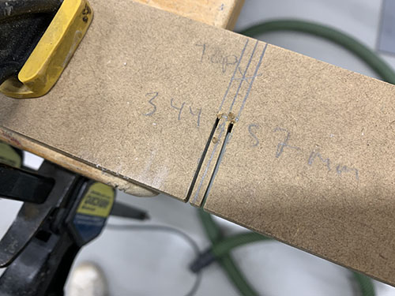
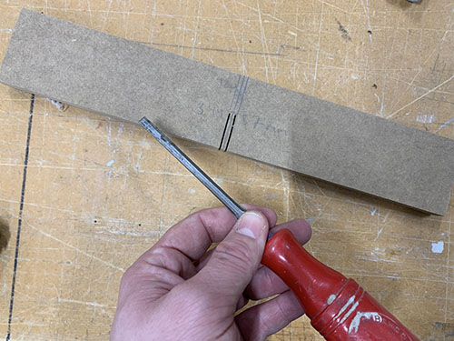
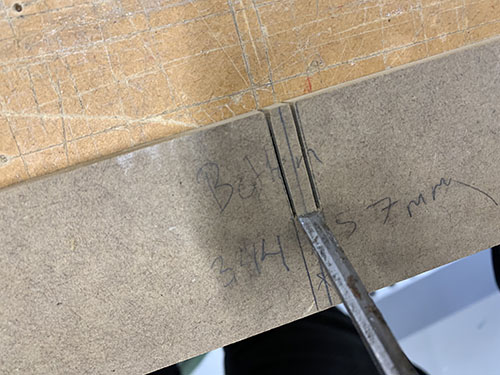
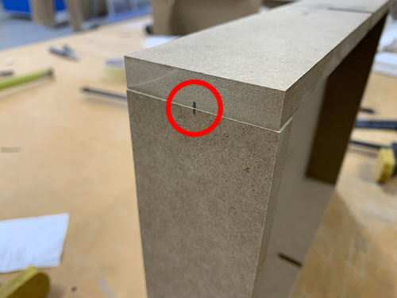
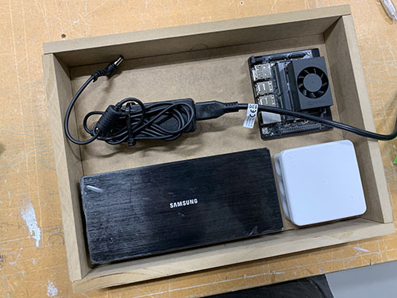

This guide goes through all the steps to build an AI-art installation, using a 
Nvidia Jetson Xavier NX and a Samsung The Frame 32". It includes pre-designed CAD-files,
how to set up the computer to run an art-kiosk (with my own code), how to build and 
assemble the control box and button box etc.

## Table of content
1. [Build control box]()
    1. ...
    2. ...
2. [Build button box]()
    1. ...
    2. ...
3. [Set up Nvidia Jetson Xavier NX]()
    1. ...
    2. ...
4. [Assemble art installation]()
    1. ...
    2. ...

### Build control box
To get a nice looking installation with few visible cables, a control box was built to 
encapsulate the Nvidia computer, power adapters, Samsung One Connect box etc.

#### Hand-cut parts
The control box was build using 12mm (0.472") MDF.


A vertical panel saw was used to cut down the MDF into smaller pieces. A table saw was 
used to cut out the final pieces.




| Piece              | Dimensions (width, height)    | Sketch                                                                         |
|--------------------|-------------------------------|--------------------------------------------------------------------------------|
| Bottom base panel  | 320mm x 235mm                 |  |
| Top lid panel      | 344mm x 259mm                 |      |
| Left side panel    | 235mm x 57mm                  |    |
| Right side panel   | 235mm x 57mm                  |   |
| Top side panel     | 344mm x 57mm                  |     |
| Bottom side panel  | 344mm x 57mm                  |  |


#### Cut cable slots
Two cable slots were cut out:

1. Cable slot in top side panel for One Connect cable and button cables.
2. Cable slot in bottom side panel for an electrical cable.

A caliper was used to measure the diameter of the cables. I then added an extra ~1mm to the slot for
the cables to fit nicely.


The slots were then outlined at the center of the panels.




A jigsaw was used to cut out the edges slots.




A small chisel and a hammer was used to remove the cut out piece.







#### Cut wood biscuits holes
To make the control box robust, wood biscuits were used to glue the parts together. By using wood biscuits, 
no screws were needed, thus giving a nice finish without visible screw heads. It also helps to aligning the
pieces when gluing.

When using the wood biscuit cutter, it's important that the holes end up at the correct place at the 
aligning panels. One simple way of solving this is to align your panels and then draw a line on both 
panels at the center of where you want the biscuit to be. If you do this, the holes will end up at the 
right place.




Before gluing the pieces together, check that the connecting holes are correctly aligning.



#### Glue parts together


### Set up Nvidia Jetson Xavier NX

#### Clone repository
```bash
git clone https://github.com/maxvfischer/Arthur.git
```

#### Set up virtual environemnt
Install `venv`:
```bash
sudo apt-get install python3-venv
```

Create environment:
```bash
python3 -m venv venv
```

Activate environment:
```bash
source venv/bin/activate
```

Install `wheel`:
```bash
sudo pip3 install wheel
```

#### Install dependencies
```bash
pip3 install -r requirements.txt
```

#### Set up user permission
We need to set up user permissions to be able to access the GPIOs.

Create new GPIO user group (remember to change `your_user_name`):
```bash
sudo groupadd -f -r gpio
sudo usermod -a -G gpio your_user_name
```

Copy custom GPIO rules (remember to change `pythonNN`):
```bash
sudo cp venv/lib/pythonNN/site-packages/Jetson/GPIO/99-gpio.rules /etc/udev/rules.d/
```

#### Add AI-model checkpoint
Copy the model checkpoint into `arthur/ml/checkpoint`:

    ├── arthur
         ├── ml
             ├── StyleGAN.model-XXXXXXX.data-00000-of-00001
             ├── StyleGAN.model-XXXXXXX.index
             └── StyleGAN.model-XXXXXXX.meta

#### Add initial active artwork
Add an initial active artwork image by copying an image here: `arthur/active_artwork.jpg`

#### Adjust config.yaml
The config.yaml contains all the settings.

```
active_artwork_file_path: 'active_artwork.jpg'  # Path and name of active artwork

aiartbutton:
  GPIO_mode: 'BOARD'  # GPIO mode
  GPIO_button: 15  # GPIO pinout used for the button
  image_directory: 'images'  # Directory to copy new images from
  button_sleep: 1.0  # Timeout in seconds after button has been pressed

ml_model:
  batch_size: 1  # Latent batch size used when generating images
  img_size: 1024  # Size of generated image (img_size, img_size)
  test_num: 20  # Number of images generated when model is triggered
  checkpoint_directory: 'ml/checkpoint'  # Checkpoint directory
  image_directory: 'images'  # Output directory of generated images
  lower_limit_num_images: 200  # Trigger model if number of images in image_directory is below this value
```
